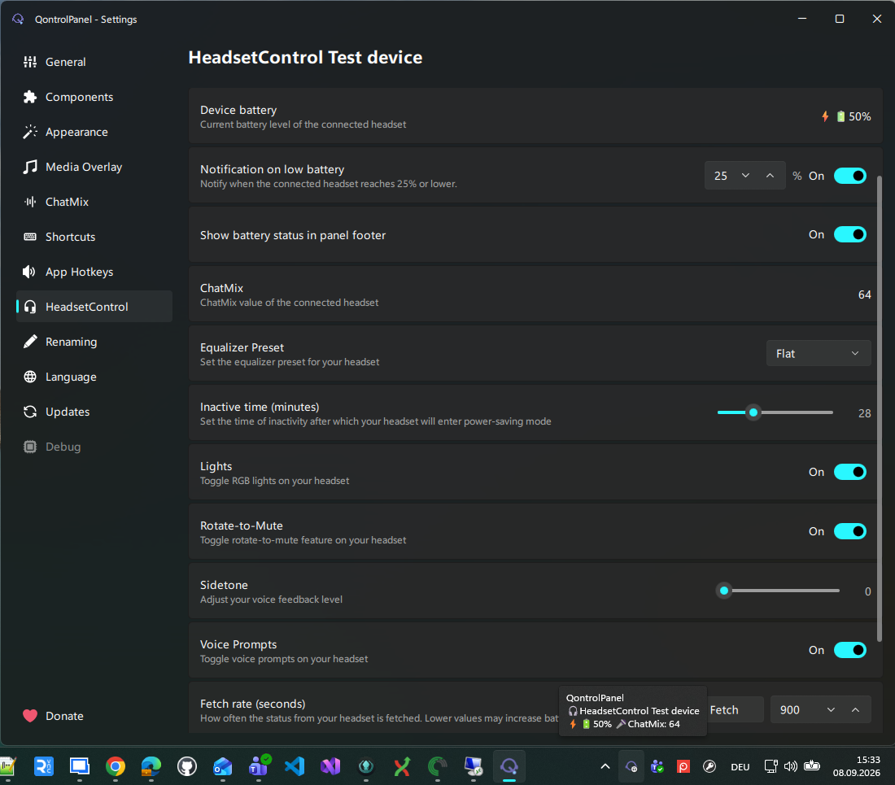

# QontrolPanel

[](<>)
[](<>)
[](<>)
[](<>)


QontrolPanel is an enhanced audio panel for Windows.  
It provide output and input volume / device / mute control as well as application volume mixer and [headsetcontrol](https://github.com/Sapd/HeadsetControl) integration.


## HeadsetControl integration


For a list of supported headsets visit [here](https://github.com/Sapd/HeadsetControl?tab=readme-ov-file#supported-devices).

If you like my work, please consider supporting me ! <br><br>
<a href="https://ko-fi.com/ChrisLauinger77" target="_blank">

</a>

## Usage

Left click on the tray icon to reveal the panel.<br>
Click anywhere or left again on the tray icon to close the panel.<br>
Double click on tray icon will open the settings pane.<br>
Default section of settings pane is configurable in General section.

## Highlights

- **Tray-first controls:** Open the compact panel instantly from the Windows system tray.
- **Output audio:** Adjust volume, mute audio, and switch between playback devices.
- **Input audio:** Control microphone volume, mute state, and the active recording device.
- **Per-application mixer:** Manage individual app volumes, names, icons, locks, and background muting.
- **ChatMix:** Keep communication apps at a dedicated volume and restore their original levels afterward.
- **Media controls:** View artwork and track details, switch media sources, control playback, and seek through supported media.
- **Display controls:** Adjust internal and external monitor brightness and control Windows Night Light.
- **HeadsetControl integration:** Monitor supported headsets and configure battery alerts, sidetone, lighting, equalizer presets, and more.
- **Keyboard shortcuts:** Configure global controls and per-application volume hotkeys.
- **Power and personalization:** Access Windows power actions and customize the panel layout, appearance, language, and behavior.

## Translations

Translators should have a look [here](TRANSLATIONS.md).

## Installation / Upgrade

### Winget

#### Install

```pwsh
winget install ChrisLauinger77.QontrolPanel
```

#### Upgrade

```pwsh
winget upgrade ChrisLauinger77.QontrolPanel
```

### Scoop

More information about scoop can be found [here](https://scoop.sh/).

#### Install

```powershell
scoop bucket add chrislauinger77 https://github.com/ChrisLauinger77/scoop-bucket
scoop install qontrolpanel
```

#### Update

```powershell
scoop update
scoop update qontrolpanel
```

### Manual

Download latest version [here](https://github.com/ChrisLauinger77/QontrolPanel/releases/latest).
Use the provided installer or download the archive, extract it, and run `bin/QontrolPanel.exe`.

## Build the project

See [here](BUILDING.md).

## Credits

- [Odizinne](https://github.com/Odizinne) for [this great tool I forked](https://github.com/Odizinne/QontrolPanel) and try to keep alive
- Used OCEAN sound effects from KDE
- Used icons from FlatIcon and VeryIcon
- Application icon from [Yogi Aprelliyanto](https://www.flaticon.com/authors/yogi-aprelliyanto)
- [Sapd](https://github.com/sapd/) for [HeadsetControl](https://github.com/Sapd/HeadsetControl)
